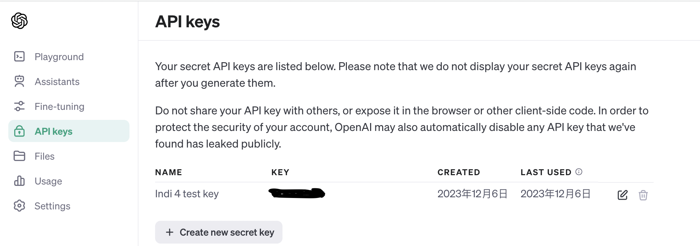
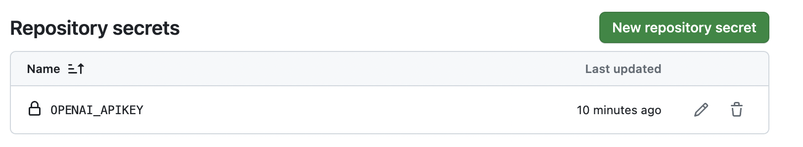

# Haochong-individual-4 
This is a repo template for course 706_Data_Engineering Individual Project 4. First of all, I create `app.py` as my Flask app. After that, I create a templete called `index.html` to show my UI. Finally, I use Azure Web App Service to deploy my app, and I use Action to run `Makefile` and got a 100% pass. 

Important files:
* `app.py`: Flask app
* `index.html`: UI
* `Dockerfile`: build image
* `.env`(hidden): store the API key
* `requirements.txt`: store the packages
* `gunicorn.conf.py`: tell the container app how to scale

## Link to the deployed app:
https://healthc.calmplant-246b7edf.westus2.azurecontainerapps.io/

## Purpose
- build a publicly accessible auto-scaling container using Azure App Services and Flask.

## Preparation 
1. Add more packagesinto the `requirement.txt`
2. Create repo on github and clone it to local
2. Log into Azure and DockerHub 

## App Introduction
- This app is a simple web app that can provide you health suggestions. It includes following features:
1. A title indicates the purpose of this app
2. A button to select what kind of health suggestions you want to get
3. A button to generate the suggestions
4. Powered by GPT 3.5 Turbo, which has been meticulously fine-tuned to replicate the role of a consultant providing health suggestions, either psysical or mental.

### DockerHub and Azure Container Apps Deployment:

- **Dockerfile:** Use `Dockerfile` to containerize the Flask app

- **Azure Container Registry :** The Docker image is hosted on Azure Container Registry

- **Azure Configuration:** Environment variables are utilized for sensitive information, for example my API tokens. 

- **Azure Container Apps Deployment:** The Flask app is successfully deployed on Azure Container Apps, providing a public endpoint for users to use my app.

## Key steps:
1. Git clone the repo to local:
- Allows me to create, run and test my code.

2. Get my OpenAI API key:
- Get my OpenAI API key from their website, create an `.env` file and set up `OPENAI_APIKEY`

3. Local test:
- run `python app.py` and make sure it works locally. 

4. Build docker image:
- Use command `docker build --tag <insert image name> .` to build the docker image.

5. login to azure cli:
- Type `az login` in terminal and login to Azure.

6. Deploy azuer web app
- Use command `az containerapp up --resource-group ind4-rg --name healthc --ingress external --target-port 50505 --source . --location westus2`. I use port 50505, and the docker image is uploaded to Azure Container Registry during this step.

7. Check the status of the deployment:
- View docker image via `container regsitry` and app via `conatiner apps` in Azure web portal.

8. Create secrets in Github:
- Create secrets in Github to store the `OPENAI_APIKEY`.

## Video demo link:

## Reference:
https://learn.microsoft.com/en-us/cli/azure/install-azure-cli-macos
https://learn.microsoft.com/en-us/cli/azure/container/app?view=azure-cli-latest#az-container-app-up
https://learn.microsoft.com/en-us/answers/questions/1195197/upstream-connect-error-or-disconnect-reset-before
https://code.visualstudio.com/docs/containers/quickstart-container-registries

